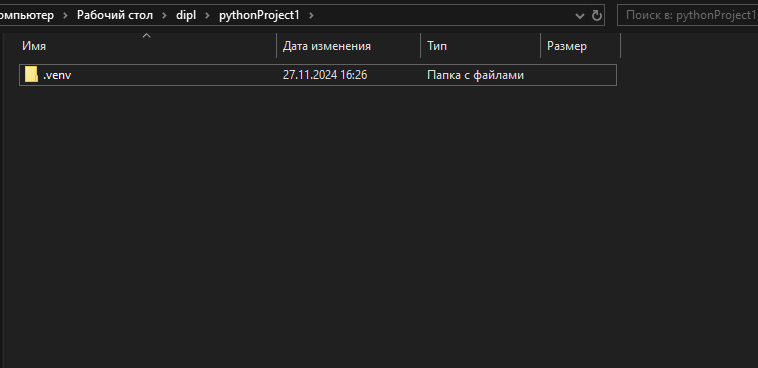
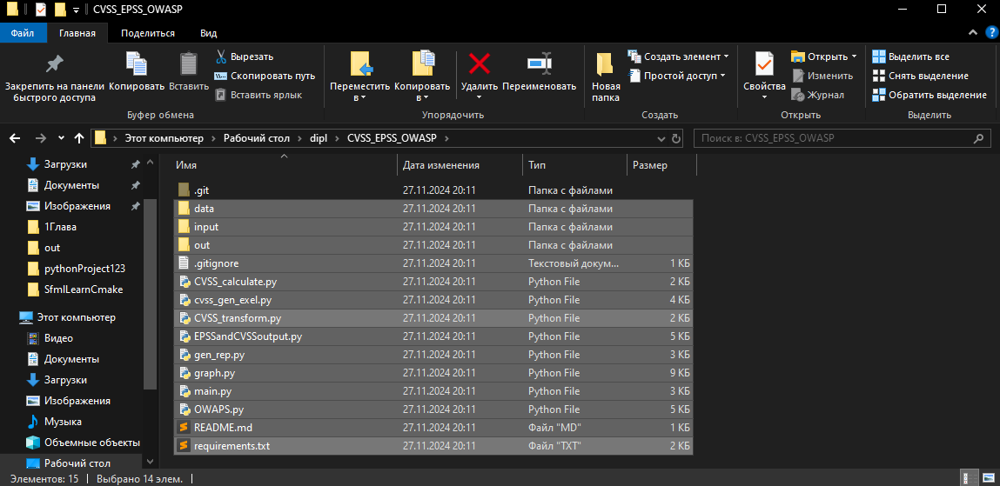
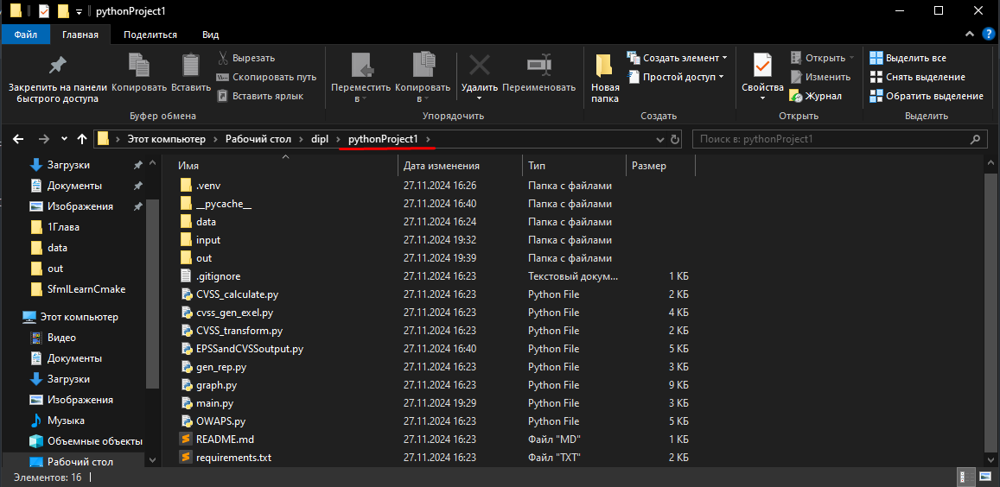
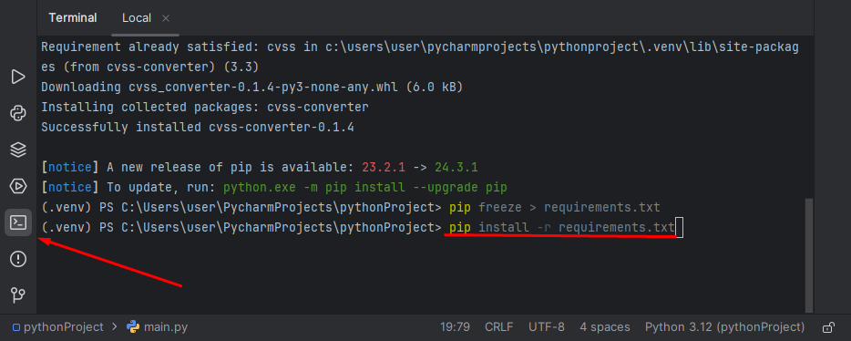
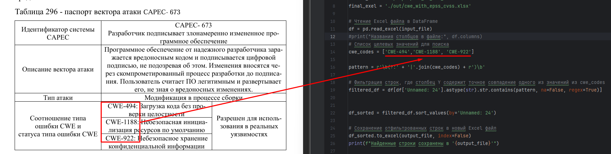
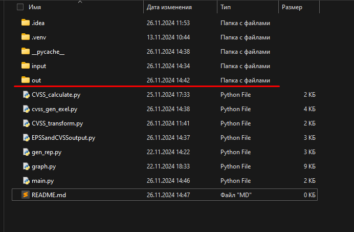
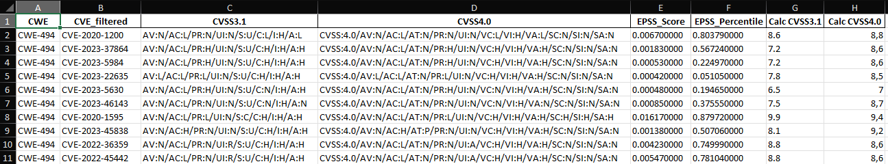

# CVSS && EPSS && OWAPS
Скрипт для автоматизированной генерации exel таблиц с рассчитанными значениями CVSS3.1; CVSS4.0; EPSS; OWASP.

Скачиваем данный репозиторий -> создаём новый проект в Python с виртуальным окружением .venv

копируем всё содержимое папки CVSS_EPSS_OWASP

в папку с нашем проектом

Заходим в питон открываем терминал и вводим:
```bash
pip install -r requirements.txt
```

## Инструкция:
1. Выбираем свой CAPEC 
2. Выбираем необходимые CWE, вставляем в скрипт. Файл main.py (14 строчка) p.s. соблюдаем синтаксис и не забываем ставить ' ',

3. Запускаем скрипт 
4. Результат работы скрипта находится в папке out

5. Итоговая тааблица на скрине ниже

